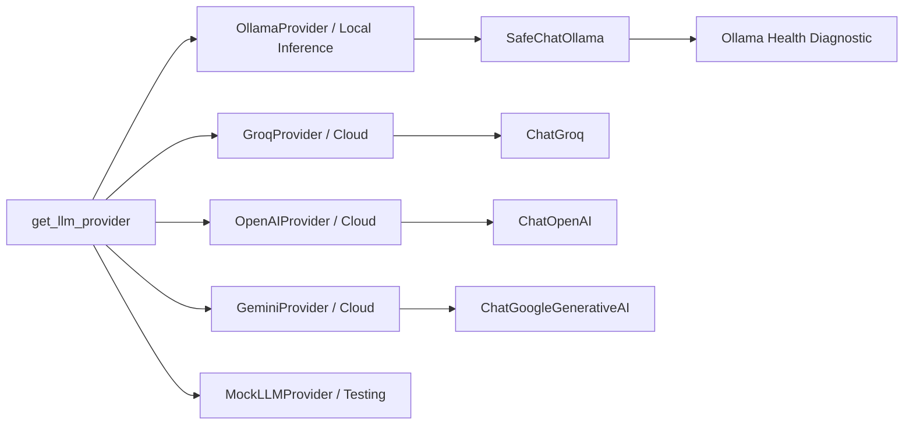

# ArcPilot — Autonomous AI SDLC Orchestration Platform

[](https://github.com/Wasim7x/ArcPilot/actions/workflows/ci.yml)
[](https://fastapi.tiangolo.com)
[](https://langchain-ai.github.io/langgraph/)
[](https://python.org)
[](https://react.dev)
[](https://github.com/PyCQA/bandit)
[](https://github.com/astral-sh/ruff)
[](LICENSE)

**ArcPilot** is an enterprise-grade autonomous Software Development Life Cycle (SDLC) orchestration platform. Powered by **LangGraph**, **FastAPI**, and a modular **React + Vite** frontend, ArcPilot transforms natural-language project requirements into complete, validated, tested, security-hardened, and containerized runnable software applications.

The platform coordinates specialized AI engineering agents through a deterministic state machine with cyclic human-in-the-loop (HITL) review gates, real AST-based static code analysis, multi-layered SAST security scanning, isolated test execution, and an automated self-healing repair loop.

---

## Table of Contents

- [Core Capabilities](#core-capabilities)
- [System Architecture](#system-architecture)
- [Workflow and State Lifecycle](#workflow-and-state-lifecycle)
- [AI and LLM Architecture](#ai-and-llm-architecture)
- [Frontend Architecture](#frontend-architecture)
- [Project Structure](#project-structure)
- [Tech Stack](#tech-stack)
- [Getting Started](#getting-started)
  - [Prerequisites](#prerequisites)
  - [Installation](#installation)
  - [Environment Configuration](#environment-configuration)
- [Running the Application](#running-the-application)
  - [Local Development](#local-development)
  - [Production Build](#production-build)
- [Deployment](#deployment)
  - [Docker Compose Deployment](#docker-compose-deployment)
  - [Systemd Linux Service](#systemd-linux-service)
- [API Reference](#api-reference)
  - [System Diagnostics](#system-diagnostics)
  - [LLM Configuration](#llm-configuration)
  - [Workflow Lifecycle](#workflow-lifecycle)
  - [Human-in-the-Loop Reviews](#human-in-the-loop-reviews)
  - [Artifacts and Workspace Exports](#artifacts-and-workspace-exports)
- [Verification and Testing](#verification-and-testing)
- [Engineering Decisions](#engineering-decisions)
- [Troubleshooting](#troubleshooting)
- [Roadmap](#roadmap)
- [License](#license)

---

## Core Capabilities

- **Multi-LLM Provider Switching**: Pluggable provider abstraction supporting local models via **Ollama** (`qwen3.8:27b`, `llama3`, etc.) and cloud APIs (**Groq**, **OpenAI**, **Google Gemini**), complete with runtime hot-swapping and health diagnostics.
- **Structured Requirements Engineering**: Automatically decomposes unconstrained natural-language inputs into validated Pydantic models containing functional requirements (FRs), non-functional requirements (NFRs), external integration contracts, user roles, system constraints, and acceptance criteria.
- **Traceability Matrix Generation**: Establishes a bidirectional traceability matrix mapping Requirement IDs to Agile User Stories, Architecture Sections, Source Code Files, Generated Test Cases, and final QA verification statuses.
- **Architecture and Specification Authoring**: Generates comprehensive Functional Design Documents (FDD) and Technical Architecture Design Documents (TDD) in Markdown format.
- **Multi-File Project Implementation**: Produces complete application repositories featuring Clean Architecture layers (FastAPI routers, Pydantic schemas, domain services, resilient HTTP clients with offline mock fallbacks, unit tests, and Docker files).
- **Automated Static Code Analysis**: Performs AST-level syntax and structural tree parsing, detecting empty exception handlers (`pass`), syntax errors, and integrating automated Ruff linting.
- **Multi-Layered Security Scanner**: Executes real static application security testing (SAST) via Bandit, regex pattern detection for leaked API keys and plaintext secrets, and heuristic scanning for command injection, unsafe deserialization, SQL formatting, and TLS bypasses.
- **Isolated Subprocess Test Runner**: Executes tests inside isolated operating-system subprocesses with environment sanitization (stripping host secrets and LLM API keys), configurable execution timeouts, and exit-code parsing.
- **Self-Healing Debug and Repair Loop**: Automatically analyzes test failure tracebacks, synthesizes diagnostic context, patches affected source files, and re-executes tests up to `MAX_REPAIR_ATTEMPTS=3`.
- **Human-in-the-Loop (HITL) Review Gates**: Native LangGraph interrupts across 7 distinct review stages, allowing reviewers to approve progress or request revisions with structured feedback loops.
- **Resilient Dual-Tier State Storage**: Workflow state namespacing (`sdlc:{task_id}:state`) backed by Redis with automatic fallback to a thread-safe, disk-backed in-memory state store (`artifacts/.state_cache.json`).
- **Production-Ready Artifact Packaging**: Packages generated project workspaces into standalone `.zip` distributions ready for containerized or bare-metal deployment.

---

## System Architecture

ArcPilot coordinates specialized engineering agents through a deterministic state machine managed by LangGraph. Workflows execute asynchronously, persisting state snapshots after each stage and pausing before review gates.

```mermaid
flowchart TD
    User([User / Developer]) <--> UI[React 18 + Vite SPA]
    UI <--> API[FastAPI Application Gateway /app.py]
    
    subgraph StorageLayer [Persistence & Cache]
        Redis[(Redis Cache)]
        DiskStore[(Disk-Backed In-Memory Cache)]
    end
    
    API <--> StorageLayer
    
    subgraph Engine [LangGraph State Engine]
        InitNode[1. Project Initialization] --> ReqNode[2. Requirements Decomposition]
        ReqNode --> StoryNode[3. User Story & Matrix Generator]
        StoryNode --> Gate1{PO Review Gate}
        
        Gate1 -- Approved --> DesignNode[4. Architecture & Design Agent]
        Gate1 -- Needs Revision --> StoryNode
        
        DesignNode --> Gate2{Design Review Gate}
        Gate2 -- Approved --> CodeNode[5. Multi-File Coding Agent]
        Gate2 -- Needs Revision --> DesignNode
        
        CodeNode --> StaticTool[AST Parser & Ruff Linter]
        StaticTool --> Gate3{Code Review Gate}
        Gate3 -- Approved --> SecNode[6. Security Review Agent]
        Gate3 -- Needs Revision --> CodeNode
        
        SecNode --> SecTool[Bandit SAST & Secret Scanner]
        SecTool --> Gate4{Security Review Gate}
        Gate4 -- Approved --> TestNode[7. Test Generation Agent]
        Gate4 -- Needs Revision --> CodeNode
        
        TestNode --> Gate5{Test Cases Review Gate}
        Gate5 -- Approved --> QANode[8. QA Isolated Test Runner]
        Gate5 -- Needs Revision --> TestNode
        
        QANode --> TestExec[Subprocess Test Execution Sandbox]
        TestExec --> TestEval{Test Outcomes}
        TestEval -- Failed & Retries < 3 --> RepairLoop[Automated Repair Loop]
        RepairLoop --> TestExec
        TestEval -- Passed or Max Retries --> Gate6{QA Review Gate}
        
        Gate6 -- Approved --> DeployNode[9. Deployment & Packaging Agent]
        Gate6 -- Needs Revision --> CodeNode
        
        DeployNode --> PkgTool[Smoke Test & ZIP Packager]
        PkgTool --> EndNode([Deployable Application Package])
    end
    
    API --> Engine
```



### Architectural Subsystems

1. **API Gateway & Web Server (`app.py`)**: Exposes RESTful endpoints, handles CORS, coordinates workflow executions inside an asynchronous thread pool executor, and mounts the pre-built frontend distribution.
2. **Workflow Graph Builder (`src/graph/graph_builder.py`)**: Assembles the LangGraph `StateGraph(SDLCState)` with memory checkpointing (`MemorySaver`), defining nodes, forward edges, and conditional routing edges.
3. **Domain Agents & Worker Nodes (`src/node/`)**:
   - `SDLCNode`: Decomposes raw requirements into structured schemas, generates Agile user stories, and initializes the traceability matrix.
   - `DesignNode`: Synthesizes Functional and Technical Architecture Design Documents.
   - `CodeNode`: Produces clean multi-file codebases and runs initial syntax checks.
   - `SecurityNode`: Scans code for vulnerabilities, OWASP risks, and hardcoded secrets.
   - `tester`: Generates unit, integration, and API test suites.
   - `qa_testing`: Executes tests in isolated subprocesses and orchestrates automated self-repair.
   - `deployment`: Conducts startup smoke tests, validates Docker configurations, and packages `.zip` archives.
4. **Tool Ecosystem (`src/tools/`)**:
   - `ProjectManagerTool`: Manages file system IO across project artifacts (`artifacts/{task_id}/`).
   - `StaticAnalysisTool`: Parses Python AST for syntax anomalies and empty handlers, running Ruff checks.
   - `SecurityScannerTool`: Executes Bandit SAST, secret regex scans, and heuristic security checks.
   - `TestExecutionEngine`: Runs pytest in a sandboxed subprocess with scrubbed environment variables.
5. **Persistence Layer (`src/cache/radis_cache.py`)**: Dual-tier state manager that persists workflow snapshots to Redis or a disk-backed in-memory store.

---

## Workflow and State Lifecycle

ArcPilot tracks each workflow session through a 13-stage progression contract defined in `app.py`:

| Stage Index | Stage Identifier | Stage Type | Description |
|:---:|---|---|---|
| 1 | `requirements` | Input Gate | Accepts raw natural-language requirements and decomposes them into structured models. |
| 2 | `user_stories` | Automated | Converts requirements into Agile stories and initializes the traceability matrix. |
| 3 | `product_owner_review` | Human Review Gate | Evaluates requirements and stories (`approve` / `request_changes`). |
| 4 | `design` | Automated | Generates Functional Design (FDD) and Technical Architecture (TDD) documents. |
| 5 | `design_review` | Human Review Gate | Technical architecture sign-off gate. |
| 6 | `code_generation` | Automated | Generates multi-file project implementation and runs AST checks. |
| 7 | `code_review` | Human Review Gate | Code quality and structural verification gate. |
| 8 | `security_review` | Human Review Gate | Security audit gate evaluating Bandit SAST and secret scan reports. |
| 9 | `test_generation` | Automated | Authors unit, integration, and API test suites. |
| 10 | `test_cases_review` | Human Review Gate | Test coverage and verification gate. |
| 11 | `qa_testing` | Automated | Executes isolated test runner and triggers the automated repair loop on failures. |
| 12 | `qa_testing_review` | Human Review Gate | Release sign-off gate evaluating QA pass/fail status. |
| 13 | `deployment` | Automated | Performs startup smoke testing, validates Docker configs, and builds the ZIP archive. |

### Human-in-the-Loop Review Mechanics

- When a human review gate is reached, execution pauses (`waiting_for_input`).
- Submitting an approval (`decision: "approve"`) transitions the workflow forward to the next automated phase.
- Submitting a revision request (`decision: "request_changes"`) requires descriptive feedback comments and routes the state back to the relevant agent node (e.g., Code Review failure returns to Code Generation).
- Concurrent submissions and duplicate reviews on completed workflows are prevented via state locks and validation guards.

---

## AI and LLM Architecture

ArcPilot features an extensible LLM provider subsystem located in `src/llm/`. The system interacts with language models through LangChain abstractions while ensuring resilience against network timeouts and format mismatches.



### Supported Providers

1. **Ollama (Local Inference)**:
   - Default Model: `qwen3.8:27b` (configurable via `OLLAMA_MODEL` or runtime payload).
   - Wrapper: `SafeChatOllama` catches server connectivity errors, missing models, and timeout events.
   - Diagnostic Probe: Queries `http://localhost:11434/api/tags` to ensure the local daemon is active and the requested model is pulled before execution begins.
2. **Groq (Cloud)**:
   - Default Model: `llama-3.3-70b-versatile`.
   - Optimized for fast token generation and rapid prototyping.
3. **OpenAI (Cloud)**:
   - Default Model: `gpt-4o-mini` (or user-specified models).
4. **Google Gemini (Cloud)**:
   - Default Model: `gemini-1.5-flash` / `gemini-2.0-flash`.
5. **Mock Provider**:
   - Used for unit testing, offline development, and continuous integration environments.

### Runtime Hot-Swapping

Providers can be hot-swapped dynamically at runtime without restarting the server:

```bash
curl -X POST http://localhost:8000/config/llm \
  -H "Content-Type: application/json" \
  -d '{"provider": "Groq", "model": "llama-3.3-70b-versatile", "api_key": "gsk_..."}'
```

The server validates provider credentials, rebuilds the active LangGraph instance with the new model, and masks all API keys in subsequent configuration responses.

---

## Frontend Architecture

The user interface is a single-page application built with **React 18** and **Vite 5**, styled with custom vanilla CSS tokens (`frontend/src/styles/index.css`) designed for developer tooling.

```
frontend/src/
├── components/
│   ├── Header.jsx             # Topbar with session info and health probe
│   ├── Sidebar.jsx            # LLM provider configuration and multi-format exports
│   ├── WorkflowProgress.jsx   # Right sidebar with 13-stage track and progress indicator
│   ├── ReviewPanel.jsx        # Reusable review gate (Approve/Reject + Feedback)
│   ├── RequirementsPanel.jsx  # Structured requirements decomposition renderer
│   ├── UserStoriesPanel.jsx   # Agile user stories with acceptance criteria
│   ├── TraceabilityMatrix.jsx # Sticky-header requirement-to-test traceability table
│   ├── ArtifactViewer.jsx     # Multi-tab artifact inspector with instant copy and export
│   ├── LoadingState.jsx       # Visual spinner and active stage indicator
│   └── ErrorState.jsx         # Contextual error card with retry action
├── pages/
│   └── Orchestrator.jsx       # Main workspace aggregating workflow cards and viewer
├── services/
│   └── api.js                 # Centralized API service with normalized models
├── hooks/
│   └── useWorkflow.js         # Reactive polling and workflow state synchronizer
├── types/
│   └── workflow.js            # Stage metadata and review gate contracts
└── utils/
    └── export.js              # Client-side TXT, JSON, and HTML report generator
```

### UI Features

- **Live Workflow Progress**: Visual tracker detailing all 13 stages with status badges (`completed`, `active`, `waiting_for_input`, `locked`).
- **Interactive Review Gates**: Dedicated review panels where developers can inspect intermediate artifacts, approve releases, or submit actionable feedback for AI self-repair.
- **Traceability Table**: Non-clipped, sticky-header table mapping requirement IDs across stories, architecture documents, code files, test IDs, and pass/fail statuses.
- **Multi-Tab Artifact Inspector**: Code viewer for generated source files, technical design documents, security audit logs, pytest execution traces, and raw JSON states.
- **Single-Click Exports**: Downloads the complete state snapshot in JSON, structured TXT, or styled standalone HTML formats.

---

## Project Structure

```
ArcPilot/
├── app.py                      # FastAPI application gateway, routes, lifecycle, static UI serving
├── Dockerfile                  # Multi-stage production container definition
├── docker-compose.yml          # Container composition for ArcPilot and Redis 7
├── pyproject.toml              # Build metadata, dependencies, pytest and ruff configurations
├── requirements.txt            # Python production dependencies
├── setup.py                    # Package installer script
├── run_app.bat                 # Windows execution batch launcher
├── run_app.ps1                 # Windows PowerShell execution launcher
├── .env.example                # Canonical template for environment variables
├── LICENSE                     # MIT License
├── src/                        # Core backend package
│   ├── cache/
│   │   └── radis_cache.py      # Dual-tier Redis and disk-backed in-memory state store
│   ├── exception/
│   │   └── __init__.py         # Custom ArcPilotException with traceback formatting
│   ├── graph/
│   │   └── graph_builder.py    # LangGraph StateGraph builder, routing, and checkpointing
│   ├── llm/                    # Unified LLM provider subsystem
│   │   ├── base.py             # LLMProvider base class and Mock provider
│   │   ├── gemni_llm.py        # Google Gemini provider implementation
│   │   ├── groq_llm.py         # Groq provider implementation
│   │   ├── ollama_llm.py       # Local Ollama provider with SafeChatOllama
│   │   └── openai_llm.py       # OpenAI provider implementation
│   ├── logger/
│   │   └── __init__.py         # Centralized structured logger
│   ├── node/                   # SDLC agent nodes and lifecycle handlers
│   │   ├── sdlc_node.py        # Requirements, user stories, traceability matrix
│   │   └── worker/             # Specialized engineering worker nodes
│   │       ├── coder.py        # Code generation and AST static analysis
│   │       ├── deployment.py   # Smoke testing, Docker check, ZIP packager
│   │       ├── doc_deginer.py  # Functional and Technical design generator
│   │       ├── qa_testing.py   # Isolated test runner and self-healing repair loop
│   │       ├── security.py     # Bandit SAST, secret scanning, heuristic analysis
│   │       └── testing.py      # Unit and integration test case authoring
│   ├── state/
│   │   └── sdlc_state.py       # Pydantic data models and SDLCState TypedDict
│   └── tools/                  # Deterministic execution tools
│       ├── markdown_tool.py    # Markdown formatting and normalization
│       ├── project_manager.py  # File system IO and ZIP packaging
│       ├── security_scanner.py # Multi-layered SAST, secret detection, OWASP checks
│       ├── static_analysis.py  # AST parser and Ruff linter execution
│       └── test_runner.py      # Subprocess test runner with env sanitization
├── frontend/                   # React 18 + Vite 5 single-page application
│   ├── dist/                   # Production build distribution served by FastAPI
│   ├── package.json            # Node.js dependencies and scripts
│   ├── vite.config.js          # Vite configuration with backend proxy
│   └── src/                    # Components, hooks, services, and styles
├── tests/                      # Automated test suite (pytest)
│   ├── conftest.py             # Global test fixtures
│   ├── test_api_endpoints.py   # REST API endpoint contracts
│   ├── test_cache.py           # Cache persistence and fallback mechanisms
│   ├── test_e2e_trip_planner.py# End-to-end SDLC generation pipeline
│   ├── test_gemini_live_flow.py# Google Gemini live workflow verification
│   ├── test_llm_providers.py   # Provider switching and fallback tests
│   ├── test_nodes.py           # Individual agent node execution
│   ├── test_ollama_integration.py # Ollama health checks and error handling
│   ├── test_review_endpoint_contract.py # Review contract validation
│   ├── test_review_loops_and_validation.py # Review rejection and loop tests
│   ├── test_state_models.py    # Pydantic serialization and schema checks
│   ├── test_tools.py           # SAST, AST, and test runner verification
│   └── test_workflow_ui_sync.py# Frontend-backend state synchronization
└── .github/
    └── workflows/
        └── ci.yml              # GitHub Actions CI pipeline (Ruff + Pytest)
```

---

## Tech Stack

| Technology | Layer / Purpose | Justification |
|---|---|---|
| **Python 3.11+** | Backend / Runtime | Core language for AI orchestration, AST parsing, and subprocess sandboxing. |
| **FastAPI** | Web API Framework | High-performance asynchronous REST API with automatic OpenAPI documentation. |
| **LangGraph** | Workflow Orchestration | Cyclic state graphs with persistent memory checkpoints and native human-in-the-loop interrupts. |
| **LangChain Core** | LLM Abstraction | Standardized model interfacing across Ollama, Groq, OpenAI, and Gemini. |
| **Pydantic v2** | Data Modeling | Strict schema validation, data serialization, and structured LLM outputs. |
| **React 18** | Frontend Application | Component-driven user interface for monitoring stages and reviewing artifacts. |
| **Vite 5** | Frontend Bundler | Rapid local compilation, developer server proxying, and lightweight production builds. |
| **Redis 7** | Cache / State Persistence | Fast key-value persistence for multi-session workflow state isolation. |
| **Ruff** | Code Quality | Extremely fast static linting for host codebase and generated projects. |
| **Bandit** | Security Analysis | AST-based Static Application Security Testing (SAST) for Python codebases. |
| **Docker & Compose** | Containerization | Multi-stage container builds ensuring identical production runtime environments. |

---

## Getting Started

### Prerequisites

- **Python 3.10+** (Python 3.11 or 3.12 recommended)
- **Node.js 18+** & **npm** (for developing or building the frontend)
- **Git**
- *(Optional)* **Ollama** installed locally from [ollama.com](https://ollama.com) if running local models.
- *(Optional)* **Docker & Docker Compose** for containerized deployments.

### Installation

1. **Clone the repository**:
   ```bash
   git clone https://github.com/Wasim7x/ArcPilot.git
   cd ArcPilot
   ```

2. **Set up a Python virtual environment**:
   ```bash
   # Linux / macOS
   python3 -m venv venv
   source venv/bin/activate

   # Windows PowerShell
   python -m venv venv
   .\venv\Scripts\Activate.ps1
   ```

3. **Install Python dependencies**:
   ```bash
   pip install --upgrade pip
   pip install -r requirements.txt
   ```

4. **Install and build the frontend**:
   ```bash
   cd frontend
   npm install
   npm run build
   cd ..
   ```

### Environment Configuration

Create a local `.env` file from the provided example:

```bash
cp .env.example .env
```

Configure your operational parameters in `.env`:

| Variable | Default Value | Required | Description |
|---|---|:---:|---|
| `LLM_PROVIDER` | `ollama` | Yes | Active provider: `ollama`, `groq`, `openai`, `gemini`, `mock`. |
| `LLM_MODEL` | `qwen3.8:27b` | Yes | Model identifier used by the active provider. |
| `OLLAMA_BASE_URL` | `http://localhost:11434` | No | Base URL for local Ollama daemon. |
| `OLLAMA_MODEL` | `qwen3.8:27b` | No | Target local Ollama model identifier. |
| `GROQ_API_KEY` | *(empty)* | Optional | API key required when using Groq. |
| `OPENAI_API_KEY` | *(empty)* | Optional | API key required when using OpenAI. |
| `GEMINI_API_KEY` | *(empty)* | Optional | API key required when using Google Gemini. |
| `ENABLE_REDIS` | `false` | No | Set to `true` to use Redis. Falls back to in-memory store if `false`. |
| `REDIS_URL` | `redis://localhost:6379/0`| No | Connection string for Redis instance. |
| `MAX_REPAIR_ATTEMPTS` | `3` | No | Maximum number of automated code repair iterations on test failure. |
| `TEST_TIMEOUT` | `45` | No | Subprocess timeout (seconds) for isolated test execution. |
| `ARTIFACTS_DIR` | `artifacts` | No | Directory path where generated projects and archives are stored. |
| `PORT` | `8000` | No | HTTP server port for FastAPI. |
| `ENVIRONMENT` | `production` | No | Runtime environment (`production`, `development`, `testing`). |

---

## Running the Application

### Local Development

To run ArcPilot in local development mode, you can start the backend and frontend independently:

```bash
# Terminal 1 — Start the FastAPI Backend
uvicorn app:app --host 0.0.0.0 --port 8000 --reload

# Terminal 2 — Start the Vite Frontend Development Server
cd frontend
npm run dev
```

- Backend API and Swagger docs: [http://localhost:8000/docs](http://localhost:8000/docs)
- Frontend Development Workspace: [http://localhost:5173/](http://localhost:5173/) *(Proxies `/sdlc`, `/workflow`, `/config`, and `/health` to port 8000)*

### Production Build

When the frontend is compiled via `npm run build`, FastAPI serves the production single-page application directly from `frontend/dist/` at the root URL:

```bash
# Compile frontend distribution
cd frontend && npm run build && cd ..

# Launch production server
uvicorn app:app --host 0.0.0.0 --port 8000
```

Access the integrated production platform at [http://localhost:8000/](http://localhost:8000/).

---

## Deployment

### Docker Compose Deployment

The repository includes a production multi-stage `Dockerfile` and a `docker-compose.yml` specifying an isolated Redis service and health check probes.

1. **Verify your `.env` configuration**:
   Ensure cloud API keys (`GROQ_API_KEY`, `OPENAI_API_KEY`, or `GEMINI_API_KEY`) are populated if using cloud providers.

2. **Launch containers**:
   ```bash
   docker compose up -d --build
   ```

3. **Check container health**:
   ```bash
   docker compose ps
   curl -f http://localhost:8000/health
   ```

4. **View application logs**:
   ```bash
   docker compose logs -f arcpilot
   ```

### Systemd Linux Service

For long-running VM or bare-metal deployments on Linux distributions:

1. **Install application to `/opt/arcpilot`**:
   ```bash
   sudo mkdir -p /opt/arcpilot
   sudo chown -R $USER:$USER /opt/arcpilot
   git clone https://github.com/Wasim7x/ArcPilot.git /opt/arcpilot
   cd /opt/arcpilot
   python3 -m venv venv
   ./venv/bin/pip install --upgrade pip
   ./venv/bin/pip install -r requirements.txt
   cd frontend && npm install && npm run build && cd ..
   ```

2. **Create unit service file** (`/etc/systemd/system/arcpilot.service`):
   ```ini
   [Unit]
   Description=ArcPilot Autonomous SDLC Orchestrator
   After=network.target

   [Service]
   Type=simple
   User=ubuntu
   WorkingDirectory=/opt/arcpilot
   EnvironmentFile=/opt/arcpilot/.env
   ExecStart=/opt/arcpilot/venv/bin/uvicorn app:app --host 0.0.0.0 --port 8000 --workers 4
   Restart=always
   RestartSec=5

   [Install]
   WantedBy=multi-user.target
   ```

3. **Enable and activate service**:
   ```bash
   sudo systemctl daemon-reload
   sudo systemctl enable arcpilot
   sudo systemctl start arcpilot
   sudo systemctl status arcpilot
   ```

---

## API Reference

Interactive API documentation and schema models are available at:
- **Swagger UI**: [http://localhost:8000/docs](http://localhost:8000/docs)
- **ReDoc**: [http://localhost:8000/redoc](http://localhost:8000/redoc)

### System Diagnostics

#### Health Check
```http
GET /health
```
**Response (200 OK)**:
```json
{
  "status": "healthy",
  "service": "ArcPilot",
  "version": "2.0.0",
  "graph_ready": true,
  "redis_connected": false,
  "active_provider": "ollama"
}
```

#### Readiness Check
```http
GET /ready
```
**Response (200 OK)**:
```json
{
  "status": "ready"
}
```

#### LLM Health Diagnostic
```http
GET /health/llm
```
**Response (200 OK)**:
```json
{
  "provider": "OllamaProvider",
  "model": "qwen3.8:27b",
  "configured": true,
  "status": "ready",
  "server_running": true,
  "model_available": true
}
```

---

### LLM Configuration

#### Hot-Swap Active LLM Provider
```http
POST /config/llm
```
**Request Body**:
```json
{
  "provider": "Groq",
  "model": "llama-3.3-70b-versatile",
  "api_key": "gsk_..."
}
```
**Response (200 OK)**:
```json
{
  "status": "ok",
  "provider": "Groq",
  "model": "llama-3.3-70b-versatile"
}
```

#### Inspect Active LLM Configuration
```http
GET /config/llm
```
**Response (200 OK)**:
```json
{
  "provider": "Groq",
  "model": "llama-3.3-70b-versatile",
  "api_key": "***"
}
```

---

### Workflow Lifecycle

#### Initialize a New SDLC Session
```http
POST /sdlc/workflow/start
```
**Request Body**:
```json
{
  "project_name": "CurrencyConverterApp",
  "initial_context": {}
}
```
**Response (200 OK)**:
```json
{
  "task_id": "sdlc-task-a1b2c3d4",
  "status": "in_progress",
  "next_required_input": "requirements",
  "progress": 10,
  "current_node": "project_initilization"
}
```

#### Submit Project Requirements
```http
POST /sdlc/workflow/{task_id}/requirements
```
**Request Body**:
```json
{
  "task": "Build a currency conversion service with real-time exchange rates, offline fallback rates, and conversion history logging."
}
```
**Response (200 OK)**:
Returns the updated workflow summary, extracted structured requirements, and initial user stories. The workflow pauses at `product_owner_review` (`progress: 30`).

---

### Human-in-the-Loop Reviews

#### Unified Review Submission
Submits an approval or revision request for any active review gate.
```http
POST /sdlc/workflow/{task_id}/review
```
**Request Body (Approve)**:
```json
{
  "stage": "product_owner_review",
  "decision": "approve",
  "feedback": "Approved user stories and scope."
}
```
**Request Body (Request Changes)**:
```json
{
  "stage": "code_review",
  "decision": "request_changes",
  "feedback": "Add input sanitization for negative currency amounts in app/services.py."
}
```

#### Dedicated Review Gate Endpoints
ArcPilot also provides stage-specific endpoints mapping directly to individual review gates:
- `POST /sdlc/workflow/{task_id}/product_owner_review`
- `POST /sdlc/workflow/{task_id}/design_review`
- `POST /sdlc/workflow/{task_id}/code_review`
- `POST /sdlc/workflow/{task_id}/security_review`
- `POST /sdlc/workflow/{task_id}/test_cases_review`
- `POST /sdlc/workflow/{task_id}/qa_testing_review`

---

### Artifacts and Workspace Exports

#### Retrieve Workflow State Snapshot
```http
GET /sdlc/workflow/{task_id}/state
```
Returns the complete workflow state including structured requirements, user stories, architecture documents, generated files, static analysis findings, security scan results, and test execution reports.

#### List Generated Files
```http
GET /sdlc/workflow/{task_id}/artifacts
```
**Response (200 OK)**:
```json
{
  "task_id": "sdlc-task-a1b2c3d4",
  "total_files": 6,
  "files": [
    "app/__init__.py",
    "app/main.py",
    "app/models.py",
    "app/services.py",
    "tests/test_services.py",
    "Dockerfile"
  ]
}
```

#### Download Application Package (.zip)
```http
GET /sdlc/workflow/{task_id}/download
```
Returns a downloadable `.zip` archive containing the entire generated workspace, ready to run.

---

## Verification and Testing

ArcPilot contains a comprehensive test suite in the `tests/` directory verifying API contracts, cache resilience, node execution, LLM provider switching, and security tool operations.

### Executing the Test Suite

Run pytest in your active environment:

```bash
pytest -v tests/
```

### Static Analysis and Security Linting

Execute host code analysis using Ruff and Bandit:

```bash
# Execute Ruff static code style and syntax checks
ruff check .

# Execute Bandit Static Application Security Testing (SAST) on src/
bandit -r src -ll
```

### Verified Test Capabilities

- **Endpoint Contracts (`test_api_endpoints.py`, `test_review_endpoint_contract.py`)**: Validates input validation, 400 Bad Request triggers, review state gates, and double-review rejection.
- **Cache Resilience (`test_cache.py`)**: Confirms transparent in-memory disk-backed fallback when Redis is offline.
- **Provider Switching (`test_llm_providers.py`, `test_ollama_integration.py`)**: Tests provider health checks and ensures runtime rejection if an Ollama model is not pulled.
- **Review Loops & Healing (`test_review_loops_and_validation.py`)**: Confirms that rejection cycles properly route back to the appropriate agent node and that mandatory feedback is enforced.
- **Deterministic Tools (`test_tools.py`)**: Validates Bandit SAST output parsing, AST syntax verification, and test execution timeouts.

---

## Engineering Decisions

1. **Deterministic Orchestration via LangGraph**:
   Rather than relying on unconstrained, autonomous agent loops that risk non-termination or drifting from requirements, ArcPilot utilizes a compiled LangGraph state graph. Every stage transition is deterministic, checkpointed, and bound by explicit validation gates.

2. **Isolated Subprocess Sandboxing for Test Execution**:
   Generated code is never executed directly inside the host Python process. The `TestExecutionEngine` spawns dedicated subprocesses while sanitizing the execution environment by stripping host API keys and database credentials, preventing accidental secret leakage.

3. **Dual-Tier State Management**:
   To prevent workflow data loss during developer server reloads or production restarts where Redis may be unavailable, ArcPilot implements an `InMemoryStateStore` with atomic file swapping (`artifacts/.state_cache.json`). Workflows automatically leverage Redis when available and fall back seamlessly without crashing.

4. **Real Tool Execution over Simulated Feedback**:
   ArcPilot does not simulate linting, security analysis, or testing via prompt engineering. The platform runs actual AST analysis, real Bandit SAST scanning, and genuine pytest test execution engines, supplying verified output to the QA and debug agents.

5. **Offline Mock Fallbacks in Generated Code**:
   When implementing external API integrations (e.g., weather or exchange rates), the coding agent generates resilient clients that fall back to deterministic mock responses if API keys are absent, ensuring that generated applications run out-of-the-box.

---

## Troubleshooting

### 1. Local Ollama Server Not Found
- **Symptom**: `RuntimeError: Local Ollama server is not running.`
- **Resolution**: Ensure Ollama is installed and run `ollama serve` in a terminal. Verify connectivity by querying `curl http://localhost:11434/api/tags`.

### 2. Ollama Model Not Installed
- **Symptom**: `400 Bad Request: Model 'qwen3.8:27b' is not installed in Ollama.`
- **Resolution**: Pull the model using `ollama pull qwen3.8:27b` (or configure a model currently installed on your system via `POST /config/llm` or `.env`).

### 3. Redis Offline Warning
- **Symptom**: `Redis is unavailable. Falling back to safe in-memory persistent state store.`
- **Resolution**: This is a non-blocking informational notice. ArcPilot automatically functions in standalone in-memory mode. If Redis is desired, set `ENABLE_REDIS=true` and start Redis on port 6379 or use `docker compose up -d redis`.

### 4. Review Rejected: Missing Feedback
- **Symptom**: `400 Bad Request: Feedback comments are required when requesting revisions.`
- **Resolution**: When rejecting an artifact or requesting revisions (`decision: "request_changes"`), you must provide a non-empty `feedback` string explaining what needs correction so the downstream agent knows how to patch the output.

### 5. Frontend Fails to Connect to API
- **Symptom**: Network error in browser console when sending requests from `http://localhost:5173`.
- **Resolution**: Ensure the FastAPI server is running on `http://localhost:8000`. The Vite development server proxy is pre-configured to route requests from port 5173 to port 8000.

---

## Roadmap

- [ ] **Streaming Progress via WebSockets**: Add real-time event streaming for token-level code generation previews and node transition notifications.
- [ ] **Git Integration & Pull Request Automation**: Directly initialize Git repositories and push generated projects as branches or PRs to GitHub and GitLab.
- [ ] **Expanded Framework Generation**: Support multi-framework generation templates (Next.js, Go, Express) in addition to the standard FastAPI architecture.
- [ ] **PostgreSQL Checkpoint Storage**: Introduce a native PostgreSQL checkpointer for distributed multi-tenant deployments.

---

## License

This project is licensed under the [MIT License](LICENSE).
